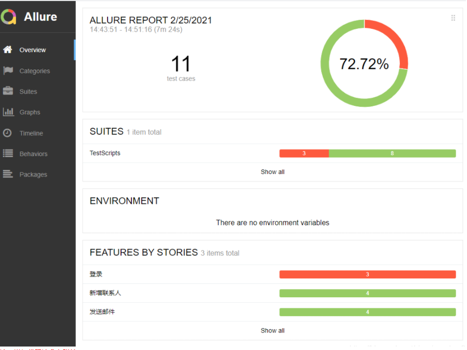

# Mailbox-test-for-126
本项目主要用python+selenuim+pytest+allure实现126邮箱登录、新增联系人、发送邮件等功能。其中测试数据使用Excel，自动化测试报告使用allure来生成。
项目说明：
本项目主要由5个模块组成：Conf、Fun、TestData、TestScripts、Util，对应包下的文件详解：
            conf（常用配置）：
                 ConfigPath.py：封装工程路径、测试数据路径、配置文件路径等方法
                 LocateExpress.ini：封装工程定位表达式
                 readexcel.py：封装操作excle文件方法
                 ReadIni.py：封装操作ini文件方法
            Fun（业务）：
                 create_contact.py:封装创建联系人业务类
                 login126.py：封装登录126邮箱业务类
                 sendemail.py：封装发送邮件业务类
            TestData（测试数据）：
                 test_data.xlsx:存放测试数据
            TestScripts(测试脚本+图形化界面报告)：
                 test_main.py：项目主函数
            Util：
                 LocateElement.py：封装定位函数，返回页面元素
实现原理：本项目主要用pytest+ddt驱动实现UI自动化，其中用excel存储测试数据，用python读取excel测试数据，读取完直接用@pytest.mark.parametrize装饰器实现测试用例参数化。
测试报告生成：本项目使用allure生成HTML测试报告
             cmd窗口进入项目目录，输入：pytest -s --alluredir ./reports/Raw/，此时开始执行测试用例
             执行完继而输入allure generate ./reports/Raw/ -o ./reports/html/ --clean生成报告的目录
测试结果如图：
             
             
             
                 
              

